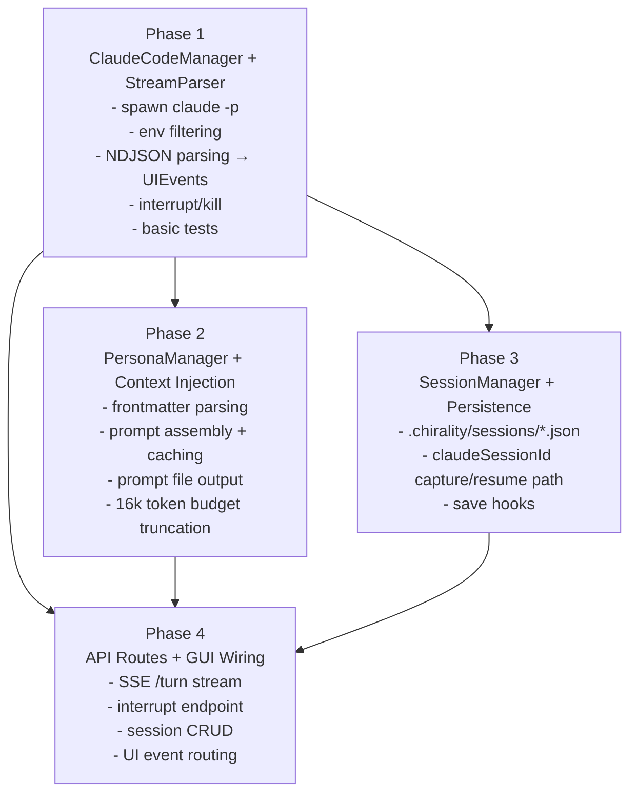
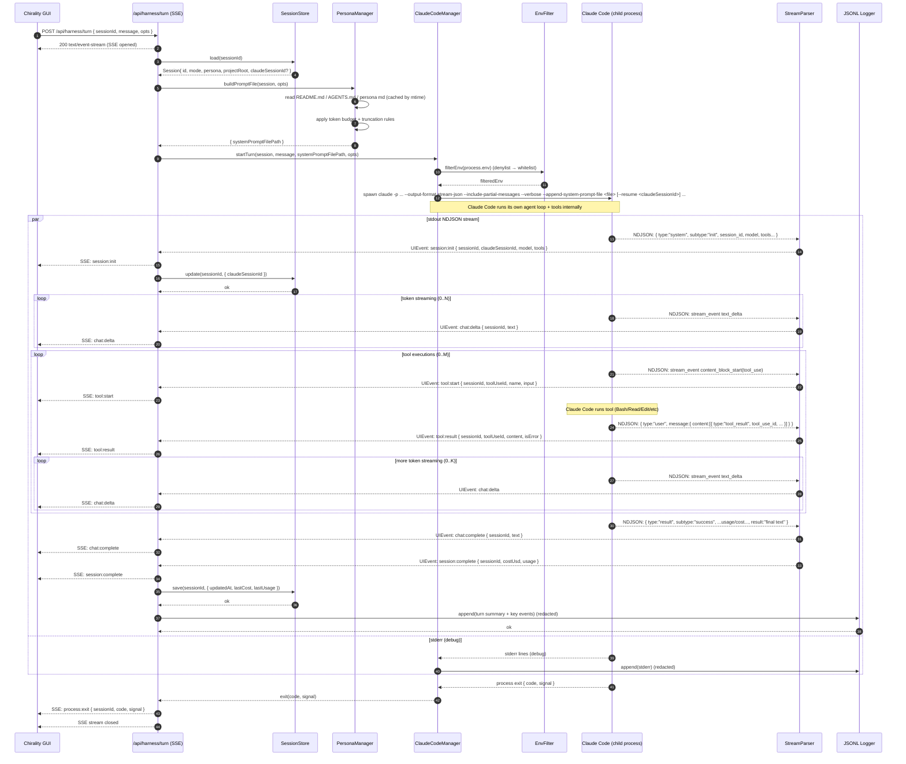

# Chirality Agent Harness (Claude Code Subprocess) — Architecture Graphs & Turn Sequence

This document contains three complementary views of the **AGENT_HARNESS_SPEC-v2.3** implementation:

1. **Module dependency graph** — how the GUI, API routes, and harness modules depend on each other at runtime.
2. **Implementation plan dependency graph** — how the build phases depend on each other (what must be implemented first).
3. **Single `/turn` sequence diagram** — the exact event ordering for one streamed turn over SSE, from request to process exit.

All diagrams are provided in **Mermaid** syntax for easy rendering in GitHub, Obsidian, Notion (Mermaid-enabled), or Mermaid Live.

---

## 1) Module dependency graph (runtime)

```mermaid
flowchart LR
  subgraph GUI["Chirality GUI (Next.js)"]
    Chat["Chat Pane"]
    Term["Terminal Pane"]
    Files["File Tree / Preview"]
  end

  subgraph API["Next.js API Routes (server-side)"]
    Turn["POST /api/harness/turn\n(SSE: UIEvents)"]
    Interrupt["POST /api/harness/interrupt"]
    SessCreate["POST /api/harness/session/create"]
    SessList["GET /api/harness/session/list"]
    SessGet["GET /api/harness/session/:id"]
    SessDel["DELETE /api/harness/session/:id"]
  end

  GUI --> Turn
  GUI --> Interrupt
  GUI --> SessCreate
  GUI --> SessList
  GUI --> SessGet
  GUI --> SessDel

  subgraph Harness["Harness Modules (per v2.3)"]
    SM["SessionManager\n(create/resume/save/list/delete)\n(.chirality/sessions/*.json)"]
    PM["PersonaManager\n(load/list/buildSystemPrompt)\n(frontmatter + context assembly)"]
    CCM["ClaudeCodeManager\n(startTurn/interrupt/kill)\n(child process + run orchestration)"]
    SP["StreamParser\n(NDJSON → UIEvents)\n(defensive JSON parsing)"]
    ENV["EnvFilter\n(denylist → whitelist)\n(API key never logged)"]
    LOG["Observability Logger\n(JSONL + rotation)\n(.chirality/logs/harness.log)"]
  end

  subgraph External["External Systems"]
    FS["Filesystem\n- projectRoot/README.md\n- projectRoot/AGENTS.md\n- projectRoot/agents/AGENT_*.md\n- .chirality/prompts/*\n- .chirality/sessions/*\n- .chirality/logs/*"]
    CLI["Claude Code CLI process\n(claude -p ... --output-format stream-json)"]
    CCStore["Claude Code session store\n(~/.claude/...)"]
    OS["OS signals\n(SIGINT/SIGTERM/SIGKILL)"]
  end

  Turn --> SM
  SM -->|Session (incl. claudeSessionId)| Turn
  Turn -->|Session + message| CCM

  CCM --> PM
  PM --> FS
  PM -->|writes| FS

  CCM --> ENV
  ENV -->|filtered env| CLI

  CCM -->|spawn| CLI
  CCM --> OS
  CLI --> CCStore

  CLI -->|stdout: NDJSON| SP
  SP -->|UIEvents| Turn
  Turn -->|SSE UIEvents| GUI

  Turn -->|save after completion| SM
  SM --> FS

  CCM --> LOG
  LOG --> FS
```

---

## 2) Implementation plan dependency graph (phases)



---

## 3) `/turn` sequence diagram (exact event ordering)


